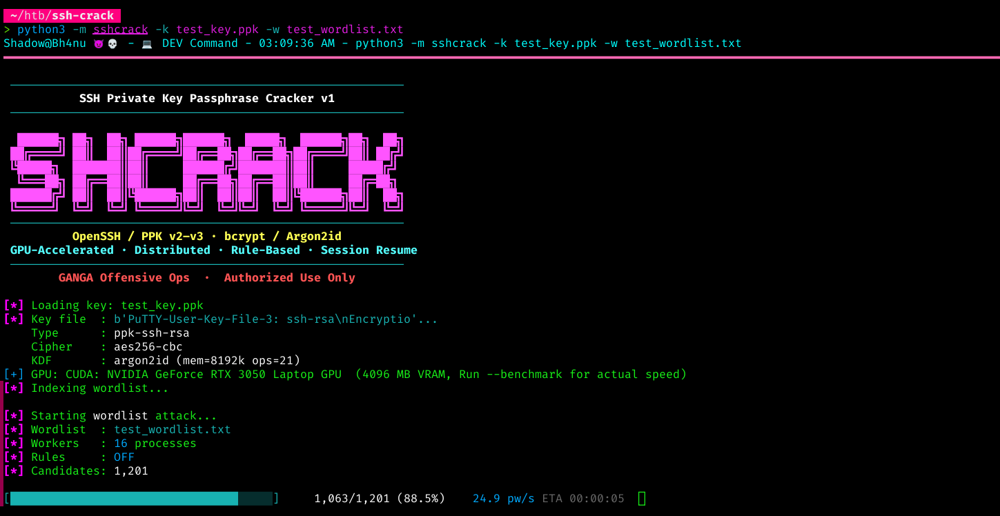

<p align="center">
  
</p>

<h1 align="center">SHCrack v1</h1>

<p align="center">
  <b>GPU-Accelerated SSH Private Key &amp; PuTTY PPK Passphrase Cracker</b><br/>
  OpenSSH · PuTTY PPK v2/v3 · bcrypt · Argon2id · Distributed · Rule-based
</p>

<p align="center">
  <a href="https://github.com/GANGAOps/SSHCrack/actions"></a>
  <a href="docs/COVERAGE.md"></a>
  <a href="docs/GPU_SETUP.md"></a>
  <a href="docs/DISTRIBUTED.md"></a>
  <a href="https://pypi.org/project/sshcrack/"></a>
  <a href="pyproject.toml"></a>
  <a href="LICENSE"></a>
</p>

<p align="center">
  <a href="#features">Features</a> ·
  <a href="#quick-start">Quick Start</a> ·
  <a href="#attack-modes">Attack Modes</a> ·
  <a href="#gpu-acceleration">GPU</a> ·
  <a href="#distributed-cracking">Distributed</a> ·
  <a href="#pentester-workflow">Workflow</a> ·
  <a href="#architecture">Architecture</a>
</p>

---

SHCrack is an open-source, GPU-accelerated SSH private key passphrase cracker supporting all major key formats — including **PuTTY PPK v3 with Argon2id** key derivation. Built for penetration testers and security researchers who need fast, reliable SSH key recovery across OpenSSH bcrypt, Legacy PEM, and PuTTY PPK formats with distributed scaling, Hashcat-compatible rule engines, and session resume.

---

## Features

- **7 key formats** — OpenSSH (Ed25519, RSA, ECDSA, DSA) + Legacy PEM (DES-EDE3/AES) + PuTTY PPK v2 (SHA-1) / PPK v3 (Argon2id)
- **GPU acceleration** — CUDA (NVIDIA) + OpenCL (AMD/Intel) — auto-detected at startup, zero configuration
- **Distributed cracking** — ZeroMQ master/worker architecture with linear N-machine throughput scaling
- **Attack modes** — Wordlist · Mutations (~100×/word) · Hashcat `.rule` files · Mask · Hybrid
- **Smart ordering** — Breach-frequency heuristics prioritise statistically likely passphrases first
- **Session resume** — Auto-saves progress every 30s; safe to Ctrl+C and restore across restarts
- **SSH verification** — Validate cracked passphrase against a live host immediately post-crack
- **Two-stage engine** — Fast-path checksum validation (8-byte MAC prefix) skips full KDF on non-matching candidates, dramatically reducing Argon2id/bcrypt cost per attempt

---

## Quick Start

```bash
# Install
pip install sshcrack

# Wordlist attack — PuTTY PPK v3 (Argon2id)
python3 -m sshcrack -k server_key.ppk -w /usr/share/wordlists/rockyou.txt

# Mask attack — known prefix + 4 unknown digits
python3 -m sshcrack -k server_key.ppk --mask 'Shadow@HTB?d?d?d?d'

# OpenSSH bcrypt key with built-in mutation rules (~100 variants per word)
python3 -m sshcrack -k id_rsa -w passwords.txt --rules

# Hybrid: each wordlist entry + 3-digit suffix
python3 -m sshcrack -k id_ed25519 -w rockyou.txt --mask '?d?d?d'
```

### Screenshots

<p align="center">
  <br/>
  <em>Real-time progress — passphrase speed, ETA, and candidate count</em>
</p>

<p align="center">
  <br/>
  <em>Wordlist attack — PuTTY PPK v3 (Argon2id, mem=8192k, ops=21)</em>
</p>

<p align="center">
  <br/>
  <em>Mask attack — <code>Shadow@HTB?d?d?d?d</code></em>
</p>

<p align="center">
  <br/>
  <em>OpenSSH Ed25519 bcrypt key — GPU-accelerated</em>
</p>

---

## Attack Modes

### Wordlist

```bash
sshcrack -k key -w rockyou.txt                         # plain wordlist
sshcrack -k key -w rockyou.txt --rules                  # +~100 mutations per word
sshcrack -k key -w rockyou.txt --rule-file best64.rule  # Hashcat .rule file
```

### Mask

```bash
sshcrack -k key --mask '?l?l?l?d?d?d'           # 3 lowercase + 3 digits
sshcrack -k key --mask '?u?l?l?l?l?d?d?d?d'     # Capitalised name + 4 digits
sshcrack -k key --mask 'Company?d?d?d?d?s'       # Literal prefix + pattern
```

| Token | Character Class |
|-------|----------------|
| `?l`  | Lowercase a–z |
| `?u`  | Uppercase A–Z |
| `?d`  | Digits 0–9 |
| `?s`  | Special characters |
| `?a`  | All printable ASCII |
| `?1–?4` | Custom user-defined charsets |

### Hybrid

```bash
sshcrack -k key -w rockyou.txt --mask '?d?d?d?d'   # each word + 4-digit suffix
```

---

## GPU Acceleration

Auto-detected at startup. No configuration needed.

```bash
sshcrack --gpu-info                              # show detected GPU + estimated speed
sshcrack -k key -w rockyou.txt                   # GPU enabled automatically
sshcrack -k key -w rockyou.txt --no-gpu          # force CPU-only mode
```

| Backend | Install | Hardware |
|---------|---------|----------|
| CUDA | `pip install pycuda` | NVIDIA GTX / RTX / Tesla |
| OpenCL | `pip install pyopencl` | AMD / Intel / NVIDIA |
| CPU | built-in | Any (SIMD-optimised via NumPy + AES-NI) |

> **Note on Argon2id speed:** PuTTY PPK v3 uses `mem=8192k, ops=21` by default — parameters deliberately chosen to resist GPU acceleration. ~25 pw/s on an RTX 3050 is expected and correct; this reflects the KDF working as designed, not a tool limitation. Use `--distributed-master` with multiple GPU workers to scale throughput linearly.

See [docs/GPU_SETUP.md](docs/GPU_SETUP.md) for CUDA/OpenCL/Docker setup.

---

## Distributed Cracking

Linear scaling — N workers = N× throughput.

```bash
# Master node (holds key + wordlist, coordinates workers)
sshcrack -k key -w rockyou.txt --distributed-master

# Worker nodes (any machine on the network)
sshcrack --distributed-worker --master 192.168.1.10

# Scale with Docker Compose
docker-compose up --scale worker=4

# AWS G5 GPU fleet — auto-deploy script
python3 scripts/deploy_aws.py \
    --key id_ed25519 --wordlist rockyou.txt \
    --workers 4 --instance g5.xlarge
```

See [docs/DISTRIBUTED.md](docs/DISTRIBUTED.md) for full deployment guide.

---

## Session Resume

```bash
# Auto-saves every 30s. Safe to interrupt at any point.
sshcrack -k key -w rockyou.txt --rules

# Resume from last checkpoint
sshcrack -k key -w rockyou.txt --rules --restore

# Named sessions — run multiple engagements in parallel
sshcrack -k key -w rockyou.txt --session engagement_1
sshcrack -k key -w rockyou.txt --session engagement_1 --restore

# Session management
sshcrack --list-sessions
sshcrack --delete-session engagement_1
```

---

## Pentester Workflow

Recommended approach for real engagements:

```bash
# 1. Identify key format, KDF, cipher, and difficulty parameters
sshcrack -k target_key --info

# 2. Benchmark speed on this key type before committing to long runs
sshcrack -k target_key --benchmark

# 3. Estimate total time for a given candidate count
sshcrack -k target_key --estimate 14344391      # rockyou.txt line count

# 4. Start with targeted wordlist + mutation rules
sshcrack -k target_key -w /usr/share/wordlists/rockyou.txt --rules \
    --session engagement_htb

# 5. Follow with mask attacks based on observed password policy
sshcrack -k target_key --mask '?u?l?l?l?l?d?d?d?s' \
    --session engagement_htb_mask

# 6. Verify cracked passphrase against live host
sshcrack -k target_key -w rockyou.txt \
    --verify-host 10.10.10.100 --verify-user admin
```

---

## All Options

```
Usage: sshcrack [OPTIONS]

  -k, --key FILE          SSH private key file (OpenSSH, PEM, PPK)
  -w, --wordlist FILE     Wordlist file ('-' for stdin)
  -t, --threads N         Worker processes (default: CPU core count)

Attack modes:
  --rules                 Built-in mutation rules (~100 variants per word)
  --rule-file FILE        Hashcat .rule file (25+ supported opcodes)
  --mask MASK             Charset mask — ?l ?u ?d ?s ?a ?1-?4
  -1/-2/-3/-4 CS          Custom charsets for mask tokens ?1–?4

GPU:
  --gpu-info              Show detected GPU and speed estimate
  --no-gpu                Disable GPU acceleration, force CPU

Distributed:
  --distributed-master    Start as master/coordinator node
  --distributed-worker    Start as worker node
  --master HOST           Master hostname or IP address
  --work-port PORT        ZeroMQ port (default: 5555)

Output:
  -o, --output FILE       Write cracked passphrase to file
  -v, --verbose           Show per-worker statistics
  -q, --quiet             Output passphrase only (scripting mode)

Session:
  --restore               Resume from last saved checkpoint
  --session NAME          Named session (default: key filename)
  --list-sessions         List all saved sessions
  --delete-session NAME   Delete a saved session

Utility:
  --info                  Display key metadata without cracking
  --benchmark             Run speed test for this key type
  --estimate N            Estimate time for N candidates
  --verify-host HOST      SSH host to verify passphrase post-crack
  --verify-port PORT      SSH port (default: 22)
  --verify-user USER      SSH username for verification
```

---

## Architecture

```
sshcrack/
├── parser.py            Key format detection + parsing (7 formats)
├── engine.py            Two-stage: fast-path checksum + full KDF confirmation
├── cracker.py           Multiprocessing orchestrator
├── wordlist.py          Streaming byte-range chunker (O(1) memory)
├── session.py           Checkpoint save/restore across restarts
├── display.py           Progress bar, results, banner
├── cli.py               CLI argument parsing + dispatch
├── rules/
│   ├── mutations.py     Built-in ~100 mutations per candidate
│   ├── mask.py          Hashcat-style mask engine (?l ?u ?d ?s ?a)
│   └── hashcat.py       Hashcat .rule file parser (25+ opcodes)
├── cpu/
│   ├── simd.py          NumPy vectorised AES batch + ctypes AES-NI
│   └── wordfreq.py      Breach-frequency smart candidate ordering
├── gpu/
│   ├── accelerator.py   CUDA/OpenCL auto-detect + dispatch
│   ├── cuda_kernel.cu   NVIDIA bcrypt GPU kernel
│   └── opencl_kernel.cl Cross-vendor OpenCL kernel
└── distributed/
    ├── master.py        ZeroMQ PUSH/PULL/PUB coordinator
    └── worker.py        Stateless GPU/CPU worker node
```

---

## Docker

```bash
# CPU
docker run --rm -v $(pwd):/work ghcr.io/gangaops/sshcrack:1.0.0 \
    -k /work/key -w /work/rockyou.txt

# GPU (NVIDIA — requires nvidia-container-toolkit)
docker run --rm --gpus all -v $(pwd):/work ghcr.io/gangaops/sshcrack:1.0.0-gpu \
    -k /work/key -w /work/rockyou.txt
```

---

## Contributing

1. Fork the repository
2. Create a feature branch (`git checkout -b feature/your-feature`)
3. Commit your changes (`git commit -m 'Add your feature'`)
4. Push to the branch (`git push origin feature/your-feature`)
5. Open a Pull Request

See [CONTRIBUTING.md](CONTRIBUTING.md) for code style, testing requirements, and PR guidelines.

---

## Responsible Use

> **This tool is for authorised penetration testing and security research only.**  
> Always obtain written permission before testing any system you do not own.  
> Unauthorised access to computer systems is illegal in most jurisdictions.

See [SECURITY.md](SECURITY.md) for vulnerability disclosure policy.

---

## License

<a href="LICENSE"></a>

Apache License 2.0 — see [LICENSE](LICENSE) for full terms.

---

<p align="center">
  Developed by <a href="https://github.com/GANGAOps"><b>GANGA Offensive Ops</b></a><br/>
  <b>Bhanu Guragain</b> — Lead Developer &amp; Author
</p>
