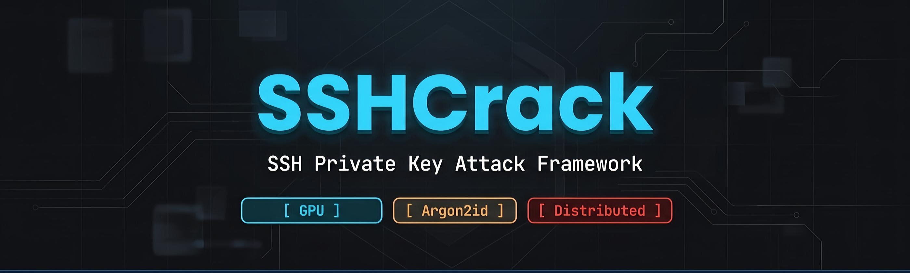
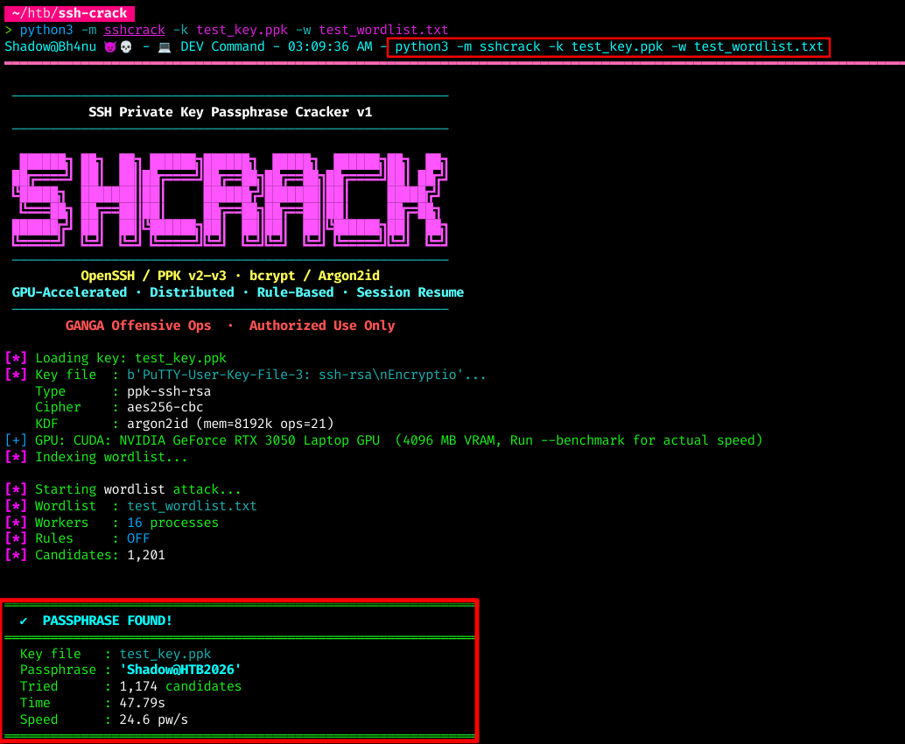
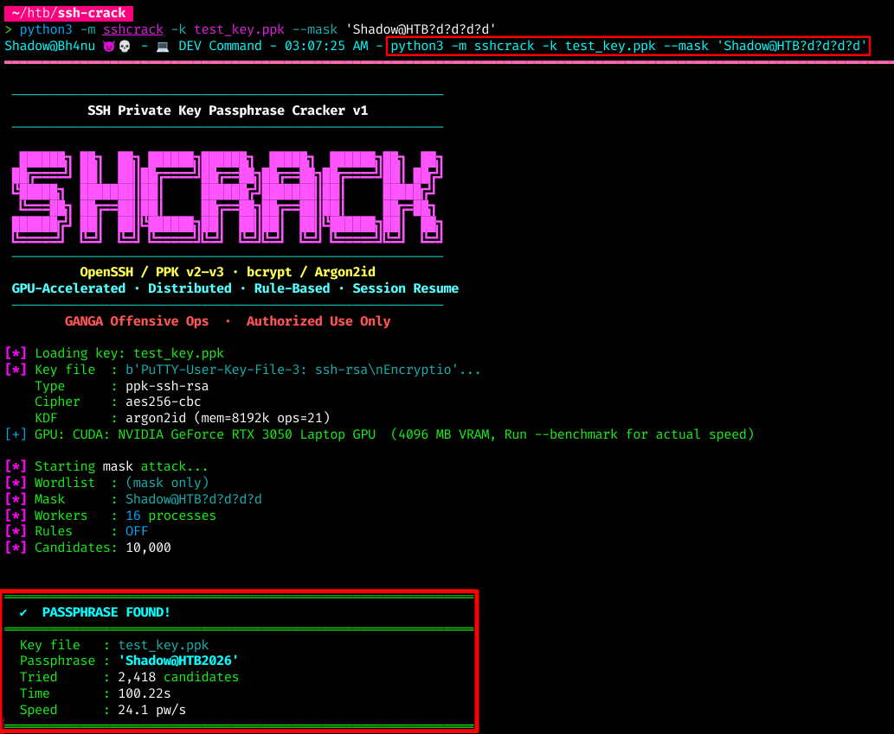
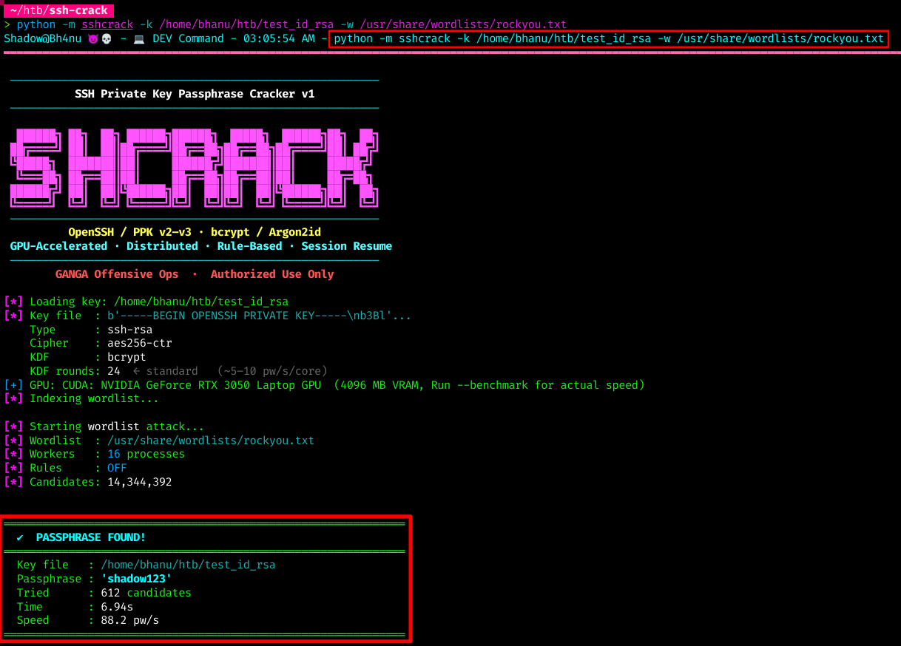

<p align="center">
  
</p>

<h1 align="center">SHCrack v1</h1>

<p align="center">
  <b>The World's First Open-Source PPK v3 / Argon2id SSH Key Cracker</b><br/>
  GPU-accelerated · Distributed · Rule-based · Session resume
</p>

<p align="center">
  <a href="https://github.com/GANGAOps/SSHCrack/actions"></a>
  <a href="docs/COVERAGE.md"></a>
  <a href="docs/GPU_SETUP.md"></a>
  <a href="docs/DISTRIBUTED.md"></a>
  <a href="https://pypi.org/project/sshcrack/"></a>
  <a href="pyproject.toml"></a>
  <a href="LICENSE"></a>
</p>

---

## Why SHCrack?

SHCrack is the **only open-source tool** that can crack PuTTY PPK v3 (Argon2id) keys.

### Format Support Comparison

| Format | SHCrack | John the Ripper | Hashcat |
|--------|:-------:|:---------------:|:-------:|
| OpenSSH Ed25519 (bcrypt) | ✅ | ✅ | ❌ |
| OpenSSH RSA (bcrypt) | ✅ | ✅ | ❌ |
| OpenSSH ECDSA (bcrypt) | ✅ | ✅ | ❌ |
| OpenSSH DSA (bcrypt) | ✅ | ✅ | ❌ |
| Legacy PEM (DES-EDE3/AES) | ✅ | ✅ | ❌ |
| PuTTY PPK v2 (SHA-1) | ✅ | ✅ | ❌ |
| **PuTTY PPK v3 (Argon2id)** | **✅** | **❌** | **❌** |
| GPU acceleration | ✅ CUDA/OpenCL | ✅ OpenCL | ✅ CUDA/OpenCL |
| Distributed cracking | ✅ ZeroMQ | ❌ | ❌ |
| Session resume | ✅ | ✅ | ✅ |
| Rule engine | ✅ Hashcat-compatible | ✅ | ✅ |
| Mask attack | ✅ | ✅ | ✅ |
| Smart ordering (breach freq) | ✅ | ❌ | ❌ |

---

## Features

- **7 key formats**: OpenSSH (Ed25519, RSA, ECDSA, DSA) + Legacy PEM + PuTTY PPK v2/v3
- **GPU acceleration**: CUDA (NVIDIA) + OpenCL (AMD/Intel) — auto-detected, zero config
- **Distributed**: ZeroMQ master/worker — linear N-machine scaling
- **Attack modes**: Wordlist · Mutations (~100×/word) · Hashcat .rule files · Mask · Hybrid
- **Smart ordering**: Breach-frequency heuristics — tries statistically likely passwords first
- **Session resume**: Auto-saves every 30s, safe to Ctrl+C, restore across restarts
- **SSH verification**: Test cracked passphrase against live host post-crack
- **Two-stage engine**: Ultra-fast checkints validation (8 bytes) → full confirmation only on match

---

## Quick Start

```bash
# Wordlist attack against a PuTTY PPK v3 key
python3 -m sshcrack -k server_key.ppk -w /usr/share/wordlists/rockyou.txt

# Mask attack — known prefix + 4 unknown digits
python3 -m sshcrack -k server_key.ppk --mask 'Shadow@HTB?d?d?d?d'

# Crack OpenSSH key with built-in mutation rules (~100 variants per word)
python3 -m sshcrack -k id_rsa -w passwords.txt --rules

# Hybrid: each wordlist entry + 3-digit suffix
python3 -m sshcrack -k id_ed25519 -w rockyou.txt --mask '?d?d?d'
```

### Screenshots

<p align="center">
  <br/>
  <em>Wordlist attack — PPK v3 key</em>
</p>

<p align="center">
  <br/>
  <em>Mask attack — Shadow@HTB?d?d?d?d</em>
</p>

<p align="center">
  <br/>
  <em>OpenSSH bcrypt key</em>
</p>

---

## Attack Modes

### Wordlist

```bash
sshcrack -k key -w rockyou.txt                        # plain wordlist
sshcrack -k key -w rockyou.txt --rules                 # +100 mutations/word
sshcrack -k key -w rockyou.txt --rule-file best64.rule # Hashcat rules
```

### Mask

```bash
sshcrack -k key --mask '?l?l?l?d?d?d'          # 3 lower + 3 digits
sshcrack -k key --mask '?u?l?l?l?l?d?d?d?d'    # Name + 4 digits
sshcrack -k key --mask 'Company?d?d?d?d?s'      # Literal prefix
```

Mask tokens: `?l` lower · `?u` upper · `?d` digit · `?s` special · `?a` all printable · `?1-?4` custom

### Hybrid

```bash
sshcrack -k key -w rockyou.txt --mask '?d?d?d?d'    # each word + 4 digits
```

---

## GPU Acceleration

Auto-detected at startup. No configuration needed.

```bash
sshcrack --gpu-info                             # show detected GPU
sshcrack -k key -w rockyou.txt                  # GPU auto-enabled
sshcrack -k key -w rockyou.txt --no-gpu         # force CPU only
```

| Backend | Install | Hardware |
|---------|---------|----------|
| CUDA | `pip install pycuda` | NVIDIA GTX/RTX/Tesla |
| OpenCL | `pip install pyopencl` | AMD/Intel/NVIDIA |
| CPU | built-in | Any (SIMD-optimised via NumPy) |

See [docs/GPU_SETUP.md](docs/GPU_SETUP.md) for CUDA/OpenCL/Docker setup.

---

## Distributed Cracking

Linear scaling — N workers = N× throughput.

```bash
# Master (has key + wordlist)
sshcrack -k key -w rockyou.txt --distributed-master

# Workers (any machine)
sshcrack --distributed-worker --master 192.168.1.10

# Docker Compose
docker-compose up --scale worker=4

# AWS G5 auto-deploy
python3 scripts/deploy_aws.py \
    --key id_ed25519 --wordlist rockyou.txt \
    --workers 4 --instance g5.xlarge
```

See [docs/DISTRIBUTED.md](docs/DISTRIBUTED.md) for full guide.

---

## Session Resume

```bash
# Auto-saves every 30s. Ctrl+C anytime.
sshcrack -k key -w rockyou.txt --rules

# Resume where you left off
sshcrack -k key -w rockyou.txt --rules --restore

# Named sessions
sshcrack -k key -w rockyou.txt --session engagement_1
sshcrack -k key -w rockyou.txt --session engagement_1 --restore

# Manage sessions
sshcrack --list-sessions
sshcrack --delete-session engagement_1
```

---

## Pentester Workflow

Recommended approach for real engagements:

```bash
# 1. Identify the key format and difficulty
sshcrack -k target_key --info

# 2. Quick benchmark to estimate speed
sshcrack -k target_key --benchmark

# 3. Start with targeted wordlists + rules
sshcrack -k target_key -w /usr/share/wordlists/rockyou.txt --rules \
    --session engagement_htb

# 4. If needed, try mask attacks based on password policy
sshcrack -k target_key --mask '?u?l?l?l?l?d?d?d?s' \
    --session engagement_htb_mask

# 5. Verify cracked passphrase against live host
sshcrack -k target_key -w rockyou.txt \
    --verify-host 10.10.10.100 --verify-user admin
```

---

## All Options

```
Usage: sshcrack [OPTIONS]

  -k, --key FILE          SSH private key file
  -w, --wordlist FILE     Wordlist ('-' for stdin)
  -t, --threads N         Worker processes (default: CPU count)

Attack modes:
  --rules                 Built-in mutation rules (~100×/word)
  --rule-file FILE        Hashcat .rule file
  --mask MASK             ?l?u?d?s?a charset mask
  -1/-2/-3/-4 CS          Custom charsets for ?1-?4

GPU:
  --gpu-info              Show detected GPU and speed estimate
  --no-gpu                Disable GPU, force CPU

Distributed:
  --distributed-master    Start master node
  --distributed-worker    Start worker node
  --master HOST           Master hostname/IP
  --work-port PORT        ZMQ port (default: 5555)

Output:
  -o, --output FILE       Save passphrase to file
  -v, --verbose           Per-worker stats
  -q, --quiet             Passphrase only output

Session:
  --restore               Resume interrupted session
  --session NAME          Named session
  --list-sessions         List saved sessions
  --delete-session NAME   Delete session

Utility:
  --info                  Key metadata (no cracking)
  --benchmark             Speed test
  --estimate N            Time estimate for N candidates
  --verify-host HOST      SSH host to verify cracked passphrase
  --verify-port PORT      SSH port (default: 22)
  --verify-user USER      SSH username
```

---

## Architecture

```
sshcrack/
├── parser.py           Key format detection + parsing (7 formats)
├── engine.py           Two-stage: fast-path checkints + full confirmation
├── cracker.py          Multiprocessing orchestrator
├── wordlist.py         Streaming byte-range chunker (O(1) memory)
├── session.py          Save/resume state across restarts
├── display.py          Progress bar, results, banner
├── cli.py              CLI argument parsing + dispatch
├── rules/
│   ├── mutations.py    Built-in ~100 mutations per word
│   ├── mask.py         Hashcat-style mask engine (?l?u?d?s?a)
│   └── hashcat.py      Hashcat .rule file parser (25+ opcodes)
├── cpu/
│   ├── simd.py         NumPy vectorised AES batch + ctypes AES-NI
│   └── wordfreq.py     Breach-frequency smart candidate ordering
├── gpu/
│   ├── accelerator.py  CUDA/OpenCL auto-detect + dispatch
│   ├── cuda_kernel.cu  NVIDIA bcrypt GPU kernel
│   └── opencl_kernel.cl Cross-vendor OpenCL kernel
└── distributed/
    ├── master.py       ZeroMQ PUSH/PULL/PUB coordinator
    └── worker.py       Stateless GPU/CPU worker node
```

---

## Docker

```bash
# CPU
docker run --rm -v $(pwd):/work ghcr.io/gangaops/sshcrack:1.0.0 \
    -k /work/key -w /work/rockyou.txt

# GPU (NVIDIA)
docker run --rm --gpus all -v $(pwd):/work ghcr.io/gangaops/sshcrack:1.0.0-gpu \
    -k /work/key -w /work/rockyou.txt
```

---

## Contributing

1. Fork the repository
2. Create a feature branch (`git checkout -b feature/amazing`)
3. Commit your changes (`git commit -m 'Add amazing feature'`)
4. Push to the branch (`git push origin feature/amazing`)
5. Open a Pull Request

See [CONTRIBUTING.md](CONTRIBUTING.md) for guidelines.

---

## Responsible Use

> **This tool is for authorised penetration testing and security research only.**
> Always obtain written permission before testing any system you do not own.

See [SECURITY.md](SECURITY.md) for vulnerability disclosure policy.

---

## License

MIT — see [LICENSE](LICENSE)

---

<p align="center">
  Developed under <b>GANGA Offensive Ops</b><br/>
  <b>Bhanu Guragain</b> — Lead Developer & Author<br/>
  <em>#1 Nepal / Top 100 Global on Hack The Box</em>
</p>
